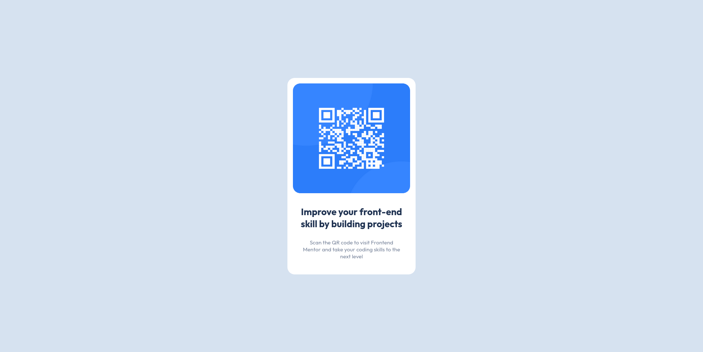

# Frontend Mentor - QR code component solution

This is a solution to the [QR code component challenge on Frontend Mentor](https://www.frontendmentor.io/challenges/qr-code-component-iux_sIO_H). Frontend Mentor challenges help you improve your coding skills by building realistic projects. 

## Table of contents

- [Overview](#overview)
  - [Screenshot](#screenshot)
  - [Links](#links)
- [My process](#my-process)
  - [Built with](#built-with)
  - [Useful resources](#useful-resources)
- [Author](#author)

## Overview

### Screenshot

### Links

- Solution URL: [Click Here](https://github.com/sibi404/frontendmentor-solutions)
- Live Site URL: [Click Here](https://sibi404.github.io/frontendmentor-solutions/)

## My process

### Built with

- Semantic HTML5 markup
- CSS custom properties
- Flexbox

### Useful resources

- [w3schools](https://www.w3schools.com/css/css3_variables.asp) - This helped me to understand the concept of varriables and also they provide platform to tryout our own code snippets

## Author

- Email - [sibikottukandiyil2@gmail.com](mailto:sibikottukandiyil2@gmail.com)
- Frontend Mentor - [sibi404](https://www.frontendmentor.io/profile/sibi404)
- Instagram - [SI BI](https://www.instagram.com/_si__bi_/)